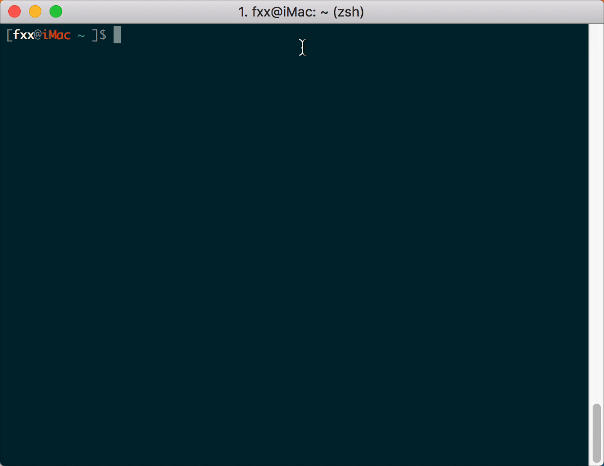

# comicd
comicd是一个漫画下载库，指定漫画主页的url或者某个章节的url，下载漫画资源。  
支持多线程可配置，代码只在Python 3.6版本上测试过。


## 支持
* [腾讯动漫](http://ac.qq.com/)
* [网易漫画](https://manhua.163.com/)
* [动漫之家](http://manhua.dmzj.com/)
* [动漫屋](http://www.dm5.com/)

## 安装
``` shell
$ git clone https://github.com/fancxxy/comicd.git ~/Works/comicd

$ cd ~/Works/comicd

$ python setup.py install
```


## 使用

``` python
# 导入模块
>>> from comicd import Comic, Chapter, Config

# 查看当前配置
>>> config = Config()
>>> config
<Config object home='/Users/fxx/Comics' threads={comic:1, chapter:1, image:5} repeat=3>

# 查看支持的网站
>>> Comic.support()
{'网易漫画', '动漫之家', '腾讯漫画', '动漫屋'}

# 创建Comic对象
>>> comic = Comic('http://ac.qq.com/Comic/comicInfo/id/505430')

# 查看Comic对象
>>> comic
<Comic object interface='腾讯漫画' title='航海王'>

# 查看漫画标题
>>> comic.title
'航海王'

# 查看漫画最近三个章节
>>> comic.chapters[-3:]
[('第884话 是谁', 'http://ac.qq.com/ComicView/index/id/505430/cid/901'), ('第885话 我叫焦糖布丁啦！！！', 'http://ac.qq.com/ComicView/index/id/505430/cid/902'), ('第886话 活法唷', 'http://ac.qq.com/ComicView/index/id/505430/cid/903')]

# 获取漫画的最新章节
# 也可以手动创建 chapter = Chapter(url)
>>> chapter = comic.latest()

# 查看Chapter对象
>>> chapter
<Chapter object interface='腾讯漫画' title='航海王' ctitle='第886话 活法唷'>

# 查看漫画标题
>>> chapter.title
'航海王'

# 查看章节标题
>>> chapter.ctitle
'第886话 活法唷'

# 查看章节页数
>>> chapter.count
22

# 查看章节所有图片
>>> chapter.images
[('24463.jpg', 'http://ac.tc.qq.com/store_file_download?buid=15017&uin=1511756996&dir_path=/&name=27_12_29_72c16a320155d5e4dc2400789546fef8_24463.jpg'), ('24464.jpg', 'http://ac.tc.qq.com/store_file_download?buid=15017&uin=1511756996&dir_path=/&name=27_12_29_8edcf3453636229c4759f97f2df90b1a_24464.jpg'), ('24483.jpg', 'http://ac.tc.qq.com/store_file_download?buid=15017&uin=1511757043&dir_path=/&name=27_12_30_8549655c2dcb399aebad83a2a5114f78_24483.jpg'), ('24465.jpg', 'http://ac.tc.qq.com/store_file_download?buid=15017&uin=1511756996&dir_path=/&name=27_12_29_51f32c0262d37ea796c29dbecf79146e_24465.jpg'), ('24466.jpg', 'http://ac.tc.qq.com/store_file_download?buid=15017&uin=1511756996&dir_path=/&name=27_12_29_ed08e78988cc84ae592c9113a3dcf7f8_24466.jpg'), ('24467.jpg', 'http://ac.tc.qq.com/store_file_download?buid=15017&uin=1511756996&dir_path=/&name=27_12_29_c2a0571466030731d321addf18918c76_24467.jpg'), ('24468.jpg', 'http://ac.tc.qq.com/store_file_download?buid=15017&uin=1511756996&dir_path=/&name=27_12_29_4001dc5d83e70cf43f47698e1eed4126_24468.jpg'), ('24469.jpg', 'http://ac.tc.qq.com/store_file_download?buid=15017&uin=1511756996&dir_path=/&name=27_12_29_f8aa453a2699a315a2bcb6d735817743_24469.jpg'), ('24470.jpg', 'http://ac.tc.qq.com/store_file_download?buid=15017&uin=1511756996&dir_path=/&name=27_12_29_bb064bf4cfaa4830602e9a16d06e9b19_24470.jpg'), ('24471.jpg', 'http://ac.tc.qq.com/store_file_download?buid=15017&uin=1511756996&dir_path=/&name=27_12_29_a376daffb735eacf340446c23d16ceb9_24471.jpg'), ('24472.jpg', 'http://ac.tc.qq.com/store_file_download?buid=15017&uin=1511756996&dir_path=/&name=27_12_29_7e76abcfdd68af20ee8f1c937e23fa56_24472.jpg'), ('24473.jpg', 'http://ac.tc.qq.com/store_file_download?buid=15017&uin=1511756996&dir_path=/&name=27_12_29_9ee0292e3200516a25922ff0272d9fc0_24473.jpg'), ('24474.jpg', 'http://ac.tc.qq.com/store_file_download?buid=15017&uin=1511756996&dir_path=/&name=27_12_29_ec61d85356a235c7293547b57040fcf2_24474.jpg'), ('24475.jpg', 'http://ac.tc.qq.com/store_file_download?buid=15017&uin=1511757010&dir_path=/&name=27_12_30_bed348a5ae19060bc5bdd484552ab745_24475.jpg'), ('24476.jpg', 'http://ac.tc.qq.com/store_file_download?buid=15017&uin=1511757010&dir_path=/&name=27_12_30_663f9d4c69b0b958de208ecd4d6df764_24476.jpg'), ('24477.jpg', 'http://ac.tc.qq.com/store_file_download?buid=15017&uin=1511757011&dir_path=/&name=27_12_30_e757cbefe0e779b3027327b969d50bcf_24477.jpg'), ('24478.jpg', 'http://ac.tc.qq.com/store_file_download?buid=15017&uin=1511757011&dir_path=/&name=27_12_30_790e8a6d130822345dd39ec8b43aab96_24478.jpg'), ('24479.jpg', 'http://ac.tc.qq.com/store_file_download?buid=15017&uin=1511757011&dir_path=/&name=27_12_30_b9c55c28c23247af8b7e992c643d35d5_24479.jpg'), ('24480.jpg', 'http://ac.tc.qq.com/store_file_download?buid=15017&uin=1511757011&dir_path=/&name=27_12_30_dd59a853438d78d44289ef912620190e_24480.jpg'), ('24481.jpg', 'http://ac.tc.qq.com/store_file_download?buid=15017&uin=1511757011&dir_path=/&name=27_12_30_0ec2b184dd94850ba7dea15a3067d4ec_24481.jpg'), ('24482.jpg', 'http://ac.tc.qq.com/store_file_download?buid=15017&uin=1511757011&dir_path=/&name=27_12_30_11aa1deb5d48e96c832551dcafeeac75_24482.jpg')]

# 下载章节所有图片
>>> chapter.download()
 <航海王> 第886话 活法唷
 
# 下载所有章节
>>> comic.download()
```

## 命令行
``` shell
$ python -m comicd -h
usage: __main__.py [-h] [-u URLS [URLS ...]] [-r] [-f FILE]

Comic Download Tool

optional arguments:
  -h, --help            show this help message and exit
  -u URLS [URLS ...], --url URLS [URLS ...]
                        urls of comics
  -r, --resume          resume last crawl task
  -f FILE, --file FILE  crawl from file
```

## 截图



